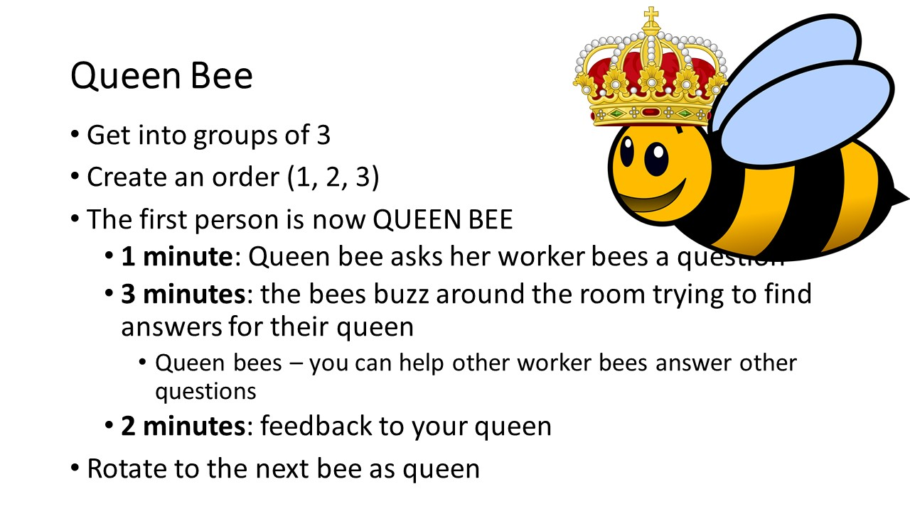

# Queen Bee

*Instructions on how to run a "queen bee" ice breaker exercise* :honeybee:

### Table of contents

* [Goals and motivations](#goals-and-motivations)
* [Materials required](#materials-required)
* [Sample script](#script)

## Goals and motivations

## Materials required

* [Title slide](#title-slide) above to be shown on the big screen at the beginning while you're talking
* An [online timer](#online-timer) to be shown on the big screen while people are taking part in the ice breaker
* A [microphone](#microphone) so you can be heard over the chatter
* A [buzzer](#buzzer) or alarm that you can use to signal moving to the next activity

### Title slide

The title slide can be downloaded either as a powerpoint file if you'd like to edit it or a jpg image if you're happy with the standard form.

* Download `pptx` [here]()
* Download `jpg` [here]()

### Online timer

A good online timer can be found at http://e.ggtimer.com.

* Open 3 tabs in your browser for [1 minute](https://e.ggtimer.com/1minutes), [3 minutes](https://e.ggtimer.com/3minutes) and [2 minutes](https://e.ggtimer.com/3minutes).
* When you need to switch to the next activity, just move to the appropriate tab and then click refresh to start the timer.

Don't worry too much about being exactly on time, its ok to click refresh after you've finished speaking for example, but do try to move the conversations along quickly.
In the best case scenario it will be difficult to break up interesting conversations.
That's the goal!
You want to leave people feeling like they want to find those people again, later in the day, to chat more.

:construction: *This timer could be improved by also showing the instruction along with the time on the screen.* :construction:  
:construction: *I (Kirstie) haven't found a good website that does this, but any suggestions are very welcome!* :construction: 

### Microphone

Hopefully there will be a lot of *buzz* (geddit?) in the room as people are having interesting conversations so it's really important that the facilitator can be heard easily.

### Buzzer

In order to get everyone's attention, it is useful to have a buzzer to indicate that the time is up and that everyone should move to the next activity.

You could either buy a loud buzzer or fog horn, or set up an alarm on your phone and hold that phone up to the microphone when it needs to be heard.

## Script

*This is a sample script that you can use as inspiration for what to say when you're facilitating a queen bee ice breaker.*
*Please edit as much as you'd like to make it sound like your voice!*

Good morning everyone!
